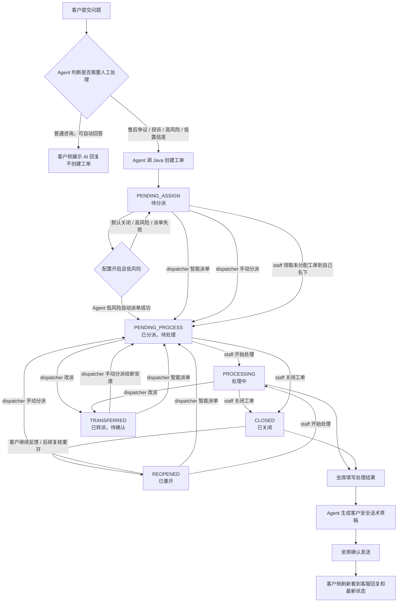

# 工单状态与角色动作流程图

本文档是工单闭环后续扩展的控制面板，用来约束“哪个角色能做什么”和“每个动作会把工单状态从哪里推到哪里”。

## 角色边界

| 角色 | 页面入口 | 核心职责 | 可以做 | 不应该做 |
| --- | --- | --- | --- | --- |
| 客户 customer | `/customer` | 提交问题、查看进度、接收回复 | 登录、提交问题、查看自己的会话和工单状态 | 查看内部分析、派单、处理工单 |
| Agent | FastAPI 服务内部 | 判断是否建单、按配置和风控决定是否低风险自动派单、生成客户话术草稿 | 创建工单、在配置开启且低风险时触发 Java 内部自动派单、生成草稿 | 直接写 Java 工单表、对高风险工单自动派单、自动发送坐席回复、覆盖人工派单 |
| 调度 dispatcher | `/dispatcher` | 分派、改派、看坐席资源状态 | 智能派单、手动分派/改派、查看全员坐席负载和反馈 | 直接处理工单、发送客户回复 |
| 坐席 staff | `/staff` | 处理自己名下工单、确认客户回复 | 领取未分配工单、开始处理、关闭工单、生成草稿、确认发送客户回复 | 给别人派单、查看全员统计、智能派单/转派 |

## 状态流转图

## 动作权限与状态变化

| 动作 | 发起角色 | 当前允许状态 | 目标状态 | 关键接口 / 代码 |
| --- | --- | --- | --- | --- |
| 提交客户问题 | customer | 无 | 可能不建单，或进入 `PENDING_ASSIGN` | `POST /api/agent/reply` |
| 创建工单 | Agent | 无 | `PENDING_ASSIGN` | `TicketTools.create_ticket` -> `POST /api/tickets` |
| 低风险自动派单 | Agent 内部 | `PENDING_ASSIGN` | 仅配置开启且风控通过时可到 `PENDING_PROCESS`，否则保持 `PENDING_ASSIGN` | `should_auto_assign_ticket` -> `POST /api/internal/tickets/{ticketNo}/auto-assign` |
| 智能派单 | dispatcher | `PENDING_ASSIGN` / `TRANSFERRED` / `REOPENED` | 有处理人则 `PENDING_PROCESS`，无处理人则保持原状态 | `POST /api/staff/tickets/{ticketNo}/auto-assign` |
| 手动分派 / 改派 | dispatcher | `PENDING_ASSIGN` / `PENDING_PROCESS` / `TRANSFERRED` / `REOPENED` | `PENDING_PROCESS` | `POST /api/staff/tickets/{ticketNo}/assign` |
| 领取工单 | staff | 未分配且 `PENDING_ASSIGN` | `PENDING_PROCESS` | `POST /api/staff/tickets/{ticketNo}/assign` |
| 开始处理 | staff | 自己名下 `PENDING_PROCESS` | `PROCESSING` | `POST /api/staff/tickets/{ticketNo}/status` |
| 关闭工单 | staff | 自己名下 `PENDING_PROCESS` / `PROCESSING` / `TRANSFERRED` / `REOPENED` | `CLOSED` | `POST /api/staff/tickets/{ticketNo}/close` |
| 转派 | dispatcher | `PENDING_PROCESS` / `PROCESSING` / `REOPENED` | `TRANSFERRED` | `POST /api/staff/tickets/{ticketNo}/transfer` |
| 生成客户话术草稿 | staff | 通常为自己名下处理中或待关闭工单 | 不改变工单状态 | `POST /api/staff/tickets/{ticketNo}/reply/draft` |
| 确认发送客户回复 | staff | 自己名下工单 | 不改变工单状态，新增客户可见消息 | `POST /api/staff/tickets/{ticketNo}/reply/send` |

## 派单控制规则

- Agent 默认不自动派单，未配置 `AGENT_AUTO_ASSIGN_TICKET` 时所有新工单保持 `PENDING_ASSIGN`。
- Agent 自动派单只允许低风险、规则明确、非真实业务动作的工单；投诉、争议、退款/退货、赔付、取消订单、低置信度和强不满场景必须由调度员确认。
- 自动派单只做推荐和落库，不调用 LLM 直接决定处理人。
- `assignedBy = MANUAL` 时，后续智能派单不得覆盖人工选择。
- 调度角色可以查看全员坐席资源状态：`GET /api/staff/members`。
- 普通坐席只能看到自己的工单和可领取的未分配工单。
- 客户侧只展示工单号、客户安全话术、状态和客服回复，不展示派单理由、AI 内部分析、风险原因和工具结果。

## 当前实现位置

| 能力 | 位置 |
| --- | --- |
| 工单状态枚举 | `business-service/src/main/java/com/example/business/entity/TicketStatus.java` |
| 工单状态流转与派单字段落库 | `business-service/src/main/java/com/example/business/service/TicketService.java` |
| 智能派单规则 | `business-service/src/main/java/com/example/business/service/TicketAssignmentService.java` |
| 坐席资源池和状态统计 | `business-service/src/main/java/com/example/business/service/StaffDirectoryService.java` |
| 坐席/调度工单接口权限 | `business-service/src/main/java/com/example/business/controller/StaffTicketController.java` |
| 坐席资源接口 | `business-service/src/main/java/com/example/business/controller/StaffMemberController.java` |
| Agent 建单后触发自动派单 | `ai-agent-service/graphs/ticket_process_graph.py` |
| Agent 调 Java 自动派单工具 | `ai-agent-service/tools/ticket_tools.py` |
| 调度台页面 | `frontend-vue/src/views/dispatcher/DispatcherHome.vue` |
| 坐席处理台页面 | `frontend-vue/src/views/staff/StaffHome.vue` |

## 后续扩展准则

- 新增状态前，必须先更新本文档中的状态流转图。
- 新增角色前，必须先明确该角色是否能派单、处理、回复、质检或查看统计。
- 高风险动作保持 Java 权限校验为准，前端隐藏按钮只作为体验优化。
- 客户可见信息和内部运营信息继续隔离，避免把派单理由、风险原因、AI 内部建议泄露到客户侧。
